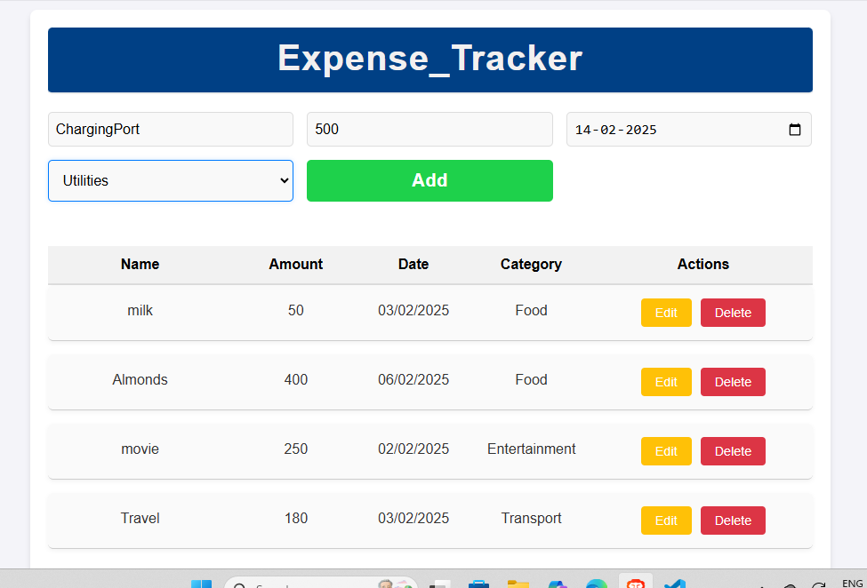

# Expense Tracker
 
An expense tracking web application built with React. This app allows users to input their expenses with details such as the name of the expense, amount, date, and category. The expenses are displayed in a list, with options to edit or delete individual entries.

## Features

- **Add Expense**: Enter the name, amount, date, and category of an expense and save it.
- **Expense List**: View all the expenses in a list format.
- **Edit Expense**: Modify the details of any added expense.
- **Delete Expense**: Remove an expense from the list.

## Technologies Used

- **React**: A JavaScript library for building user interfaces.
- **JavaScript**: For handling app logic and functionalities.
- **CSS**: For styling the application (can be customized as per your preferences).

## Screenshots

  
*(Include a screenshot of your app here)*

## Installation

To run the project locally, follow these steps:

1. **Clone the repository**:
   ```bash
   git clone https://github.com/your-username/expense_tracker.git
   
2. **Navigate to the project directory**:
    ```bash
     cd expense_tracker
3. **Install dependencies**:
   Make sure you have Node.js installed. Then, run the following command to install the project dependencies:
   ```bash
   npm install
